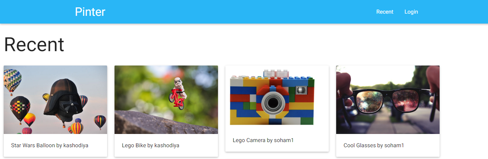
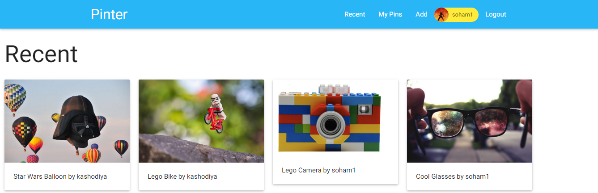
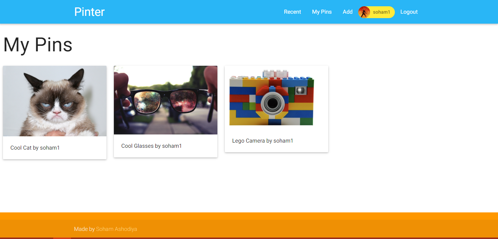
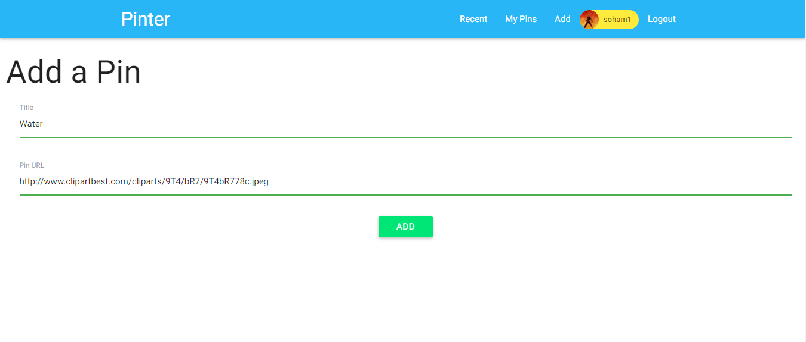
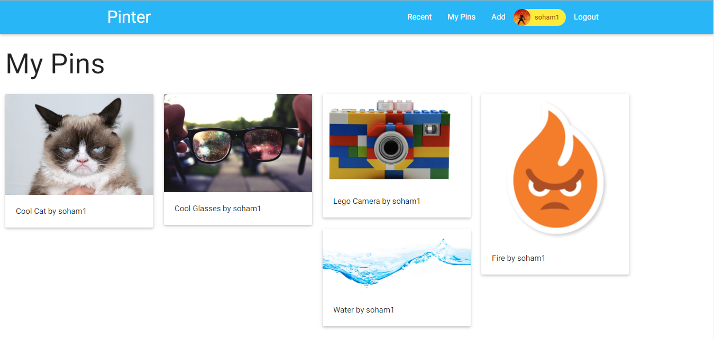
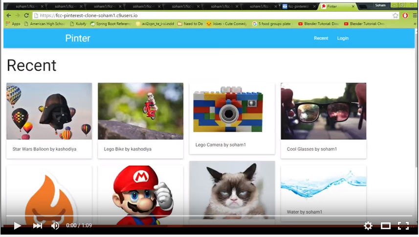

#Pinterest Clone

This is a solution for http://www.freecodecamp.com/challenges/build-a-pinterest-clone

User Story: As an unauthenticated user, I can login with Github.

User Story: As an authenticated user, I can link to images.

User Story: As an authenticated user, I can delete images that I've linked to.

User Story: As an authenticated user, I can see a Pinterest-style wall of all the images I've linked to.

User Story: As an unauthenticated user, I can browse other users' walls of images.

User Story: As an authenticated user, if I upload an image that is broken, it will be replaced by a placeholder image. (can use jQuery broken image detection)

##Screenshots:

###Homepage (Without logging in)

###Recent Page (With logging in)

###My Pins

###Adding a Pin (By providing title and image URL)

###When we go back to Recent page, we see our newly added pin!

##Demo:

##Technologies Used:
- Node.js
- Express
- Masonry.js
- MongoDB
- Passport